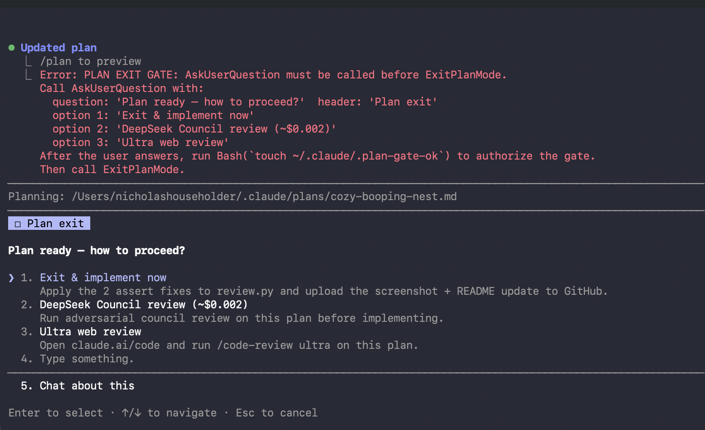
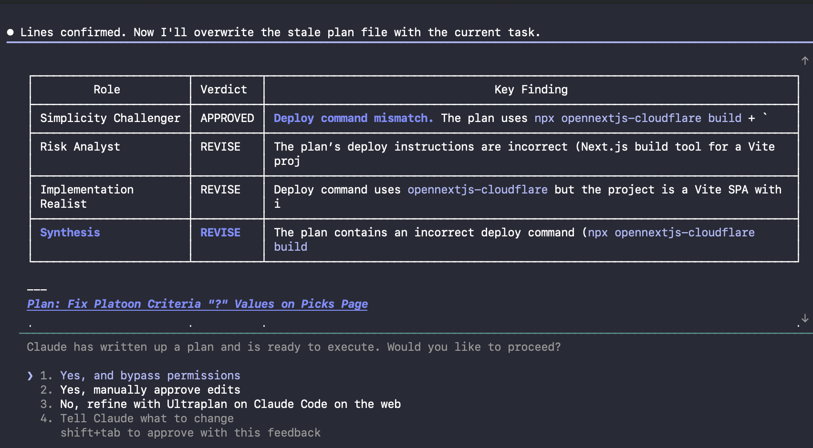

# deepseek-council

Adversarial AI review of your implementation plan before you write a line of code — powered by DeepSeek V4 Pro.

---

| Stat | Value |
|------|-------|
| Cost per council run | $0.003–$0.007 |
| Finding specificity | 99.9% (983/984 cite a file, function, or step number) |
| Approval rate | 17.1% — the council is not a rubber stamp |
| Plan-change rate | 98% — when flagged REVISE, the plan changed 146/149 times |
| Meta-judge quality | 2.2/3.0 avg (findings rated by a separate judge call) |
| Reviews run | 285 |

---

## The problem

You write a plan. Claude says "looks good." You implement it. You hit bugs that were always in the design.

deepseek-council runs 4 adversarial LLM roles in parallel against your plan — before implementation — catching what one perspective misses. Each role stays in its lane. A synthesis agent consolidates their findings. You get a concrete APPROVED / REVISE / MAJOR_REVISE verdict with specific, actionable issues.

---

## How it works

Four roles review your plan independently in parallel:

| Role | Lane |
|------|------|
| Risk Analyst | Data loss, race conditions, missing rollbacks, security gaps, undefined behavior under load |
| Implementation Realist | Ambiguous steps, undefined functions/files, missing success criteria, unclear ordering |
| Simplicity Challenger | Over-engineering, scope creep, unnecessary abstractions, simpler paths to the same outcome |
| Senior Dev Realist | Production-quality code: idiomatic patterns, stdlib vs. custom, testability, tech debt, would-a-PR-reviewer-approve |

Each role can be assigned a different LLM provider for **model diversity** — different training data and RLHF biases mean uncorrelated blind spots, so the council catches issues that same-model multi-prompting misses. Configure role providers in `providers.json`.

A Synthesis agent consolidates their findings and gives a final verdict:

- **APPROVED** — no MAJOR_REVISE votes and at most 1 minor REVISE
- **REVISE** — one or more concrete, actionable issues to address
- **MAJOR_REVISE** — serious issues from any reviewer; do not start coding

Results append to `PLAN-REVIEW-LOG.md` next to your plan file. A meta-judge call rates each finding on a 1–3 quality scale so you know which issues are worth acting on.

---

## Real example

A CLV tracking plan that looked fine. Three minutes and $0.0051 later:

```
$ python3 review.py --plan PLAN.md --council

[council] deepseek-v4-pro/anthropic-haiku/gemini-flash — 4 roles in parallel... est. cost: ~$0.0051
[council] Simplicity Challenger [gemini-flash]: REVISE
[council] Implementation Realist [anthropic-haiku]: REVISE
[council] Risk Analyst [deepseek-v4-pro]: REVISE
[council] Senior Dev Realist [deepseek-v4-pro]: REVISE
[council] Synthesizing... REVISE

━━━━━━━━━━━━━━━ COUNCIL DEBATE ━━━━━━━━━━━━━━━

Simplicity Challenger — REVISE
  • The entire outcome can be achieved by adding `open_ml` to the existing picks log — no separate ledger, patching pipeline, or seeding script needed.
  • 4 new code locations introduced when 1 change suffices.

Implementation Realist — REVISE
  • `compute_clv()` is called but never defined. No moneyline-to-probability conversion specified (+138 vs -138). Gets this wrong -> silently corrupts every CLV value.
  • `is_fade` flag stored but CLV sign inversion for fade bets never addressed — all fade-system CLV values will be systematically wrong.

Risk Analyst — REVISE
  • `system_clv_ledger.json` single-file JSON: concurrent read-modify-write across 3 pipeline phases with no locking. Silent data corruption under normal sequential use is possible.
  • Seed script has no deduplication — re-run after failure silently doubles all historical CLV.

Senior Dev Realist — REVISE
  • Raw dict with string keys used throughout where a `CLVEntry` dataclass would enforce required fields at write time.
  • No unit test path exists — ledger is both written and read by the same function, blocking isolation.

Consensus: All roles recommend revision.

━━━━━━━━━━━━━━━ SYNTHESIS ━━━━━━━━━━━━━━━

High-confidence (2+ reviewers):
- Single JSON ledger lacks atomicity — concurrent read/modify/write can corrupt the file
- Normalization runs after seeding, creating key mismatch between old and new entries

Other findings:
- compute_clv() undefined — corrupts all CLV values if wrong
- is_fade sign inversion missing — all fade bets get inverted CLV

Specificity: 14/14 findings concrete (100%) -> HIGH
Cost: $0.0051
```

When you're ready to implement, the plan-exit gate intercepts ExitPlanMode and prompts you to run the council first:



The council also prepends a verdict table to the top of your plan file — the first thing you see when you open it:



What changed after this review: dropped the separate ledger entirely (Simplicity Challenger was right), defined `compute_clv()` with explicit US odds conversion, added `is_fade` sign inversion, replaced JSON rewrite with append-only writes + atomic rename.

---

## Quick start

```bash
git clone https://github.com/nhouseholder/deepseek-council
cd deepseek-council
bash setup.sh

# Add your DeepSeek API key (get one at platform.deepseek.com):
echo 'DEEPSEEK_API_KEY=your_key_here' >> ~/.plan-council/.env

# DeepSeek V4 Pro is enabled by default — check estimated cost:
python3 review.py --plan PLAN.md --discover

# Single review (1 model, up to 3 rounds):
python3 review.py --plan PLAN.md

# Full council (4 roles in parallel + synthesis, ~$0.003–$0.007):
python3 review.py --plan PLAN.md --council
```

---

## Provider support

Works with any of:

| Provider | Key env var | Input / Output (per 1M tokens) | Notes |
|----------|-------------|-------------------------------|-------|
| DeepSeek V4 Pro | `DEEPSEEK_API_KEY` | $0.27 / $1.10 | Default — cheapest quality-tier |
| Gemini Flash | `GEMINI_API_KEY` | $0.15 / $0.60 | Auto-discovers latest model version |
| Gemini Pro | `GEMINI_API_KEY` | $1.25 / $10.00 | Best Gemini quality |
| GPT-4o Mini | `OPENAI_API_KEY` | $0.15 / $0.60 | OpenAI compatible |
| Claude Haiku | `ANTHROPIC_API_KEY` | $0.80 / $4.00 | Anthropic native |

Add any OpenAI-compatible API by adding an entry to `providers.json` with `"format": "openai"`.

---

## API key setup

**Option A — environment variable (easiest):**
```bash
export DEEPSEEK_API_KEY=your_key_here
python3 review.py --plan PLAN.md --council
```

**Option B — `~/.plan-council/.env`:**
```
DEEPSEEK_API_KEY=your_key_here
```
Run `bash setup.sh` to create this file with a template.

**Option C — Claude Code users:**
Already works if you have `~/.claude/credentials/master.env` with your key set there.

Priority order: environment variable > `~/.plan-council/.env` > `~/.claude/credentials/master.env`.

---

## Claude Code / Cursor integration

Add to your plan-exit gate in `CLAUDE.md`:

```
python3 /path/to/deepseek-council/review.py --plan PLAN.md --council
```

Or wire as a hook that fires after `PLAN.md` is written. The `--json-output` flag emits hook-compatible JSON:

```json
{"continue": true, "agent_message": "council: REVISE — compute_clv() undefined (~$0.0051). Report -> PLAN-REVIEW-LOG.md"}
```

---

## Output files

- `PLAN-REVIEW-LOG.md` — full council output, appended to the plan's directory after each run
- `~/.plan-council/reviewer-metrics.jsonl` — per-run metrics (cost, verdict, quality scores)

---

## Requirements

- Python 3.9+
- `curl`
- No other dependencies

---

## License

MIT
